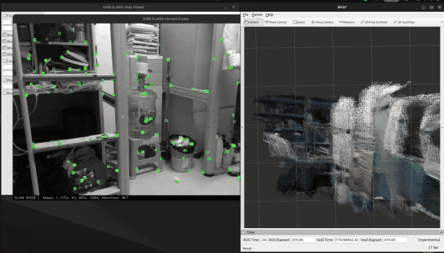

<p align="center">
  
  
</p>

<h1 align="center">Dense-ORB-SLAM3</h1>

<p align="center">
  <a href="README_EN.md">English</a> ·
  <a href="README_CH.md">中文</a>
</p>

This repository is a modified version of [ORB_SLAM3](https://github.com/UZ-SLAMLab/ORB_SLAM3). It builds the ORB-SLAM3 core library, dense RGB-D mapping examples, camera configuration files, calibration utilities, and point-cloud tools.

If you want to use this project through ROS 2, put the sibling wrapper repository [`orbslam3_dense_ros2`](../src/orbslam3_dense_ros2/README.md) in the same workspace. That ROS 2 package links to the library and files generated here. Remote repository: [Pplll-pppl/dense_orbslam3_ros2](https://github.com/Pplll-pppl/dense_orbslam3_ros2).

## Recommended Layout

```text
<your_ws>/
  dense_orbslam3/              # this repository
  src/orbslam3_dense_ros2/     # optional ROS 2 wrapper
```

Replace `<your_ws>` with your own workspace path in every command below.

## File Map

| Path | Purpose |
|------|---------|
| `Vocabulary/ORBvoc.txt` | ORB vocabulary required by ORB-SLAM3 executables and ROS 2 wrapper |
| `Examples/RGB-D/TUM*.yaml` | TUM RGB-D camera parameter files |
| `Examples/RGB-D/RealSense_D435i.yaml` | RealSense D435i RGB-D camera parameters |
| `Examples/RGB-D/associations/*.txt` | TUM RGB-D timestamp association files |
| `dataset/TUM-RGBD/<sequence>` | Optional local TUM RGB-D datasets |
| `lib/libORB_SLAM3.so` | Core library generated by `./build.sh`; used by the ROS 2 wrapper |
| `Examples/RGB-D/rgbd_tum_dense.cc` | Offline RGB-D dense mapping example |
| `Examples/RGB-D/*realsense_D435i*.cc` | RealSense RGB-D examples |
| `Examples/RGB-D/*.pcd` | Dense point cloud inputs or outputs for later processing |
| `Examples/RGB-D/room_size_calc*.cc` | Room-size and structural point-cloud analysis tools |
| `Examples/Calibration/*` | RealSense recording and Kalibr calibration helpers |
| `3rdParty/` | Locally built OpenCV, PCL, Pangolin, and related dependencies if used |

The ROS 2 wrapper usually needs `lib/libORB_SLAM3.so`, `Vocabulary/ORBvoc.txt`, the correct camera `.yaml`, optional dataset/association files, and any `.pcd` file you want to convert to OctoMap.

--- 

## Modification
- Succesfully tested in **Ubuntu 24.04** and **ROS2 Jazzy**(with OpenCV 4.9.0)
- Update from C++11 to C++17
- RGB-D ROS2 dense mapping dependency and crash fix notes: [docs/rgbd_dense_ros2_dependency_and_crash_fix.md](docs/rgbd_dense_ros2_dependency_and_crash_fix.md)

**Rectified** camera type  

## How to build
Clone the repository:
```
git clone https://github.com/Pplll-pppl/Dense_OrbSlam3.git dense_orbslam3
```

Install same required dependencies as original version ([ORB_SLAM3](https://github.com/UZ-SLAMLab/ORB_SLAM3) / [ORB-SLAM3-STEREO-FIXED](https://github.com/zang09/ORB-SLAM3-STEREO-FIXED.git)). 
Additionally, PCL 1.10 is required to generate dense point cloud. You can install it in the same path of OpenCV and Pangolin.
Then,  Execute:
```
cd <your_ws>/dense_orbslam3
chmod +x build.sh
./build.sh
```
This will create **libORB_SLAM3.so**  at *lib* folder and the executables in *Examples* folder.

## Run examples
- This project integrate dense mapping function. Currently, only **rgbd_tum_dense.cc** is available.
To run the dense mapping example, execute:
```
cd <your_ws>/dense_orbslam3/Examples/RGB-D ## replace with your own path

./rgbd_tum_dense --tum <your_ws>/dense_orbslam3/dataset/TUM-RGBD/rgbd_dataset_freiburg1_room:<your_ws>/dense_orbslam3/Examples/RGB-D/associations/fr1_room.txt --voc <your_ws>/dense_orbslam3/Vocabulary/ORBvoc.txt --param <your_ws>/dense_orbslam3/Examples/RGB-D/TUM1.yaml
 ## replace with your own path

```

```
cd <your_ws>/dense_orbslam3/Examples/RGB-D ## replace with your own path

./rgbd_tum_dense --tum <your_ws>/dense_orbslam3/dataset/TUM-RGBD/rgbd_dataset_freiburg3_long_office_household:<your_ws>/dense_orbslam3/Examples/RGB-D/associations/fr3_room.txt --voc <your_ws>/dense_orbslam3/Vocabulary/ORBvoc.txt --param <your_ws>/dense_orbslam3/Examples/RGB-D/TUM3.yaml
 ## replace with your own path

```

- To run the example with realsense D435i, execute:
  
```
cd <your_ws>/dense_orbslam3/Examples/RGB-D ## replace with your own path
```

```
./rgbd_realsense_D435i <your_ws>/dense_orbslam3/Vocabulary/ORBvoc.txt <your_ws>/dense_orbslam3/Examples/RGB-D/RealSense_D435i.yaml <your_ws>/dense_orbslam3/trajectory_d435i.txt
```
- To run the example with realsense D435i dense mapping, execute:
  
```
cd <your_ws>/dense_orbslam3/Examples/RGB-D ## replace with your own path
```

```
./rgbd_dense_realsense_D435i <your_ws>/dense_orbslam3/Vocabulary/ORBvoc.txt <your_ws>/dense_orbslam3/Examples/RGB-D/RealSense_D435i.yaml <your_ws>/dense_orbslam3/trajectory_d435i.txt --dense
```
- To run the example with realsense D435i inertial dense mapping, execute:
  
```
cd <your_ws>/dense_orbslam3/Examples/RGB-D-Inertial ## replace with your own path
```

```
./rgbd_dense_inertial_realsense_D435i <your_ws>/dense_orbslam3/Vocabulary/ORBvoc.txt <your_ws>/dense_orbslam3/Examples/RGB-D-Inertial/RealSense_D435i.yaml <your_ws>/dense_orbslam3/trajectory_d435i.txt --dense
```


### Calibration

Nowadays Kalibr and ROS1 are two popular tools for camera calibration. 
However, for ubuntu 24.04, Kalibr is not well integrated with ROS1. 
So it could be difficult to build Kalibr locally and use it in ROS1. To figure this dilemma, we can use kalibr in docker and first record data (pictures and IMU data) with the script (recorder_realsense_D435i.cc) provided by orbslam3.

#### Deploy Kalibr in Docker

First, install relevant packages in your host system:
```
sudo apt update
sudo apt install -y ca-certificates curl gnupg lsb-release
```
Then add official GPG key to docker:
```
curl -fsSL https://download.docker.com/linux/ubuntu/gpg | sudo gpg --dearmor -o /etc/apt/trusted.gpg.d/docker.gpg

```
Add software source of docker:
```
eecho "deb [arch=$(dpkg --print-architecture)] https://download.docker.com/linux/ubuntu $(lsb_release -cs) stable" | sudo tee /etc/apt/sources.list.d/docker.list > /dev/null

```
install docker Engine:
```
sudo apt update
sudo apt install -y docker-ce docker-ce-cli containerd.io
```
validate docker installation:
```
docker --version
# output like : Docker version 26.1.3, build b72abbb
```
Pull kalibr image from docker hub:
```
docker pull stereolabs/kalibr:latest
```
Check images in docker:
```
docker images
```
Create and run a container:
```
docker run -it --rm -v <your_ws>/dense_orbslam3:/data stereolabs/kalibr /bin/bash 
```

#### Camera intrinsics

First record the camera data:

```
./Examples/Calibration/recorder_realsense_D435i ./Examples/Calibration/recorder_visual
```
Then process IMU data:
```
python3 ./Examples/Calibration/python_scripts/process_imu.py ./Examples/Calibration/recorder_visual/
```
To get into docker container:
```
docker run -it --rm -v <your_ws>/dense_orbslam3:/data stereolabs/kalibr /bin/bash
```

convert the data into ROS bag:
```
kalibr_bagcreater --folder /data/Examples/Calibration/recorder_visual/ --output-bag /data/Examples/Calibration/recorder_visual.bag
```
Start calibration:
```
kalibr_calibrate_cameras --bag /data/Examples/Calibration/recorder_visual.bag --topics /cam0/image_raw --models pinhole-radtan --target /data/Examples/Calibration/recorder_empty/april_6x6_80x80cm_larues.yaml
```

If the calibration is successful, you can get the camera intrinsics.

**attention** Everytime recording a new bag please remember to delete the original data in recorder_visual folder **!!!**

##### potential error and solution
- **error: Cameras are not connected through mutual observations, please check the dataset. Maybe adjust the approx. sync. tolerance.
Traceback (most recent call last):
  File "/kalibr_workspace/devel/bin/kalibr_calibrate_cameras", line 15, in <module>
    exec(compile(fh.read(), python_script, 'exec'), context)
  File "/kalibr_workspace/src/Kalibr/aslam_offline_calibration/kalibr/python/kalibr_calibrate_cameras", line 447, in <module>
    main()
  File "/kalibr_workspace/src/Kalibr/aslam_offline_calibration/kalibr/python/kalibr_calibrate_cameras", line 204, in main
    graph.plotGraph()
  File "/kalibr_workspace/src/Kalibr/aslam_offline_calibration/kalibr/python/kalibr_camera_calibration/MulticamGraph.py", line 311, in plotGraph
    edge_label=self.G.es["weight"],
KeyError: 'Attribute does not exist'**
  
  - reason: in the source code of the steroelab's Kalibr image, part of the code in file **"/kalibr_workspace/src/Kalibr/aslam_offline_calibration/kalibr/python/kalibr_camera_calibration/MulticamGraph.py"** is not compatible for single camera calibration.Specifically, it is in the function **isCameraConnected**, which is originally:
    ```
    def isGraphConnected(self):
        #check if all vertices are connected
        return self.G.adhesion()
    ```


  - solution: modify the function **isGraphConnected** in file **"/kalibr_workspace/src/Kalibr/aslam_offline_calibration/kalibr/python/kalibr_camera_calibration/MulticamGraph.py"** as follows:
    ```
    def isGraphConnected(self):

        if self.numCams == 1:
            # Since igaph 0.8, adhesion correctly returns 0 for the non-connected one cam case.
            #   which evaluates to false later on. So we skip the check and return true in the one camera case.
            return True
        else:
            #check if all vertices are connected
            return self.G.adhesion()
        #returns the list of cam_ids that share common view with the specified cam_id

    def getCamOverlaps(self, cam_id):
    ```
    **notice**: We conduct this operation in container which means it's only a temporary adjustment, and the original code will be restored after the container is stopped. So to have a permanent fix, it is recommended that create your own Kalibr image with the modified code.


## RGB-D Executable Commands

Run the commands below from:

```bash
cd <your_ws>/dense_orbslam3/Examples/RGB-D
```

### TUM examples

```bash
./rgbd_tum \
  <your_ws>/dense_orbslam3/Vocabulary/ORBvoc.txt \
  <your_ws>/dense_orbslam3/Examples/RGB-D/TUM1.yaml \
  <your_ws>/dense_orbslam3/dataset/TUM-RGBD/rgbd_dataset_freiburg1_room \
  <your_ws>/dense_orbslam3/Examples/RGB-D/associations/fr1_room.txt
```

```bash
./rgbd_tum_dense \
  --tum <your_ws>/dense_orbslam3/dataset/TUM-RGBD/rgbd_dataset_freiburg1_room:<your_ws>/dense_orbslam3/Examples/RGB-D/associations/fr1_room.txt \
  --voc <your_ws>/dense_orbslam3/Vocabulary/ORBvoc.txt \
  --param <your_ws>/dense_orbslam3/Examples/RGB-D/TUM1.yaml
```

### RealSense examples

These commands require a connected RealSense D435i device.

```bash
./rgbd_realsense_D435i \
  <your_ws>/dense_orbslam3/Vocabulary/ORBvoc.txt \
  <your_ws>/dense_orbslam3/Examples/RGB-D/RealSense_D435i.yaml \
  <your_ws>/dense_orbslam3/trajectory_d435i.txt
```

```bash
./rgbd_dense_realsense_D435i \
  <your_ws>/dense_orbslam3/Vocabulary/ORBvoc.txt \
  <your_ws>/dense_orbslam3/Examples/RGB-D/RealSense_D435i.yaml \
  <your_ws>/dense_orbslam3/trajectory_d435i.txt \
  --dense
```

### Point cloud tools

```bash
./rotate_pcd
```

```bash
./light_pca_shear_project \
  <your_ws>/dense_orbslam3/Examples/RGB-D/PointCloudMapping_RGBD.pcd \
  <your_ws>/dense_orbslam3/Examples/RGB-D/light_pca_shear_project_corrected.pcd \
  <your_ws>/dense_orbslam3/Examples/RGB-D/light_pca_shear_project_projection.csv
```

### Room size calculation examples

```bash
./room_size_calc_non_destructive_planes
```

For the room-size tools above, you can also pass a custom point cloud path:

```bash
./room_size_calc_non_destructive_planes /absolute/path/to/your_cloud.pcd
```
